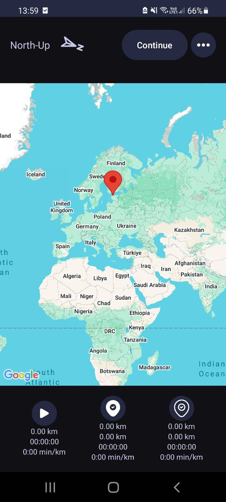
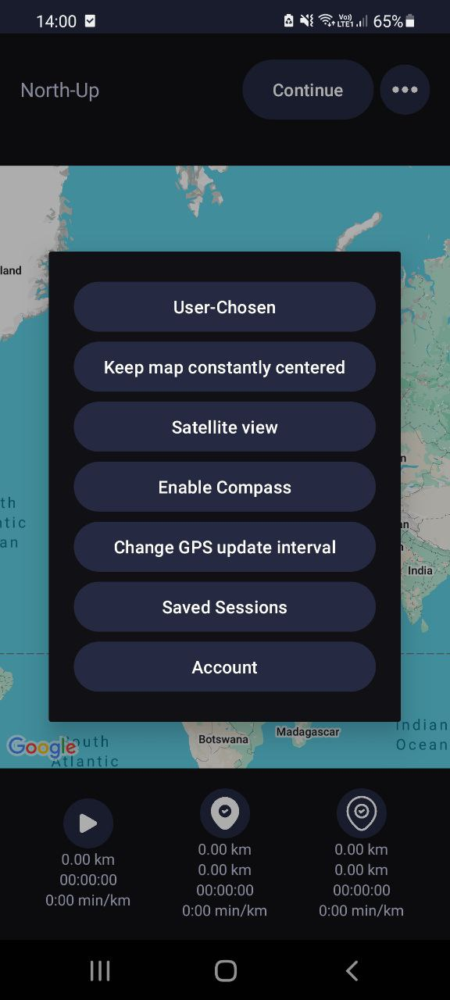
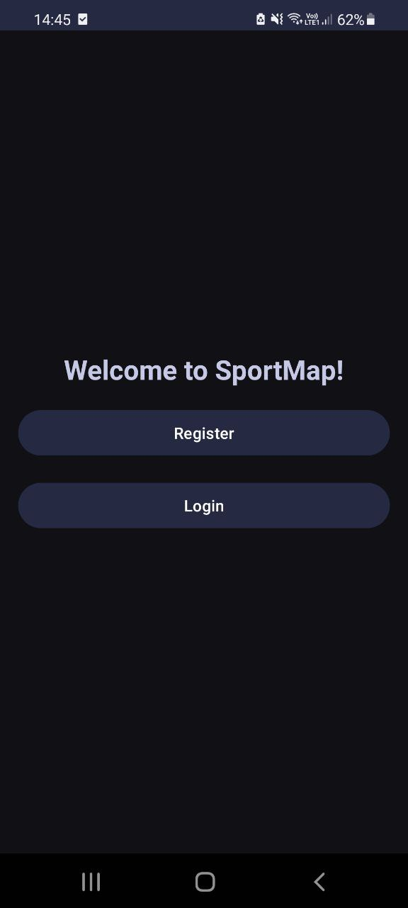
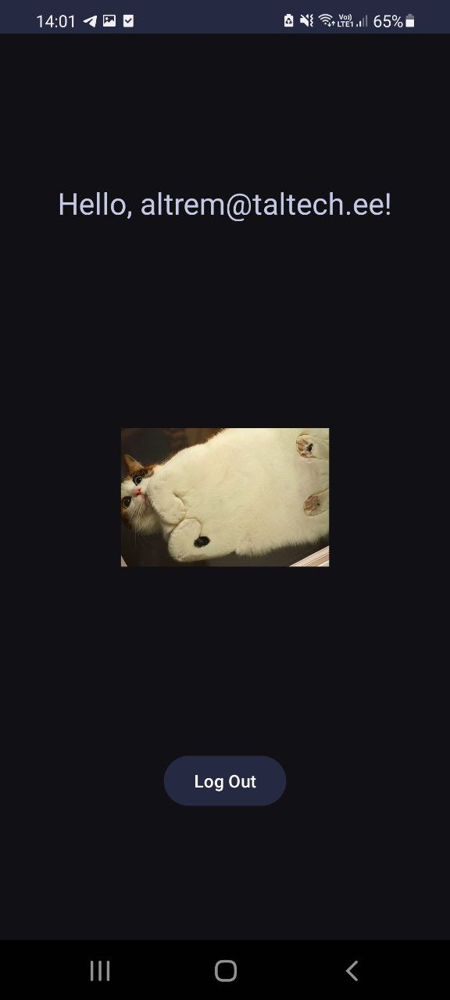
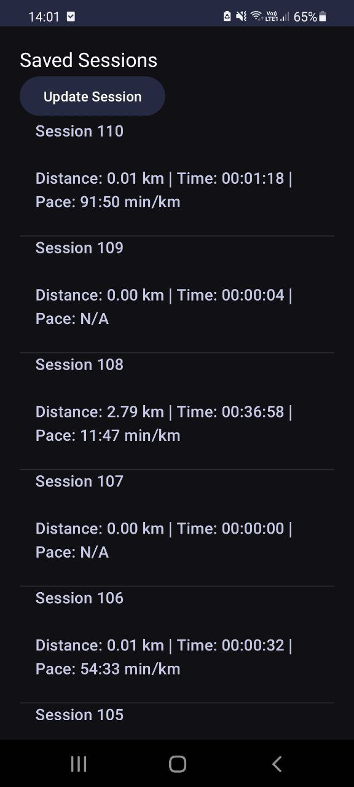
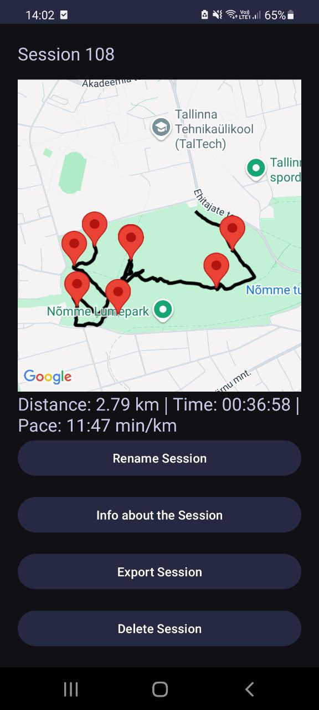
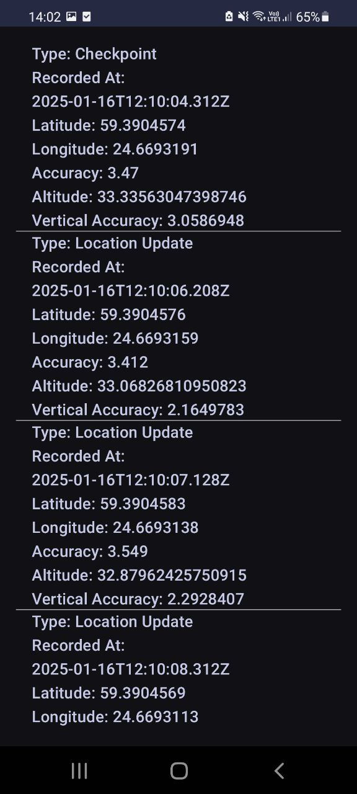

## GPS tracking app for Native Mobile Apps Development

## Features!
#### Cool self-made icon

#### App UI

##### - Main screen 

  
- Shows the direction of the map on the screen
- Compass points in the north direction in real life
- Google map API renders the map and shows uour location
- Start session button allows you to start the session, track session time, track length and your speed
- Checkpoint button sets a permanent checpockpoint on the map and saves it into the database. It also allows your to track distances, the time you walked and your speed since the last checpockpoint
- Waypoint button is the same, except its not permanent

##### - Main menu

  
Features: 
- Allows to choose the direction of map
- Allows you to keep the map constantly centered or move it freely
- Sattelite or Normal map view
- Enable and disable compass
- Allows to change GPS update interval
- Saved session page
- Account page

##### - Account page

  
The logic for this uses backend provided by taltech, allowing to create accounts and send data such as location updates, etc. It is possible to register your account to backend and to log into it.
  

  
When logged in, user's email is displayed. To make UI more interesting, I integrated CATAAS (Cat as a service) API, displaying a picture of a cat every time someone enters account page.
  
##### - Saved sessions

App allows to display all the walking sessions with basic session info in a preview.

To get more info on specific session, user can click on the session and session map page will open.
  

  
- A map with walked track and checkpoints put during session will be displayed.
- User can rename the session.
- User can get more information about data sent to backend.
- It is possible to export session in gpx format.
- User can delete session.
  
This is how data sent to backend looks like:
  

##### - Android notification

When user starts the session, a sticky notification that allows user to put checkpoints and waypoints from lock screen, as well as track distance.

